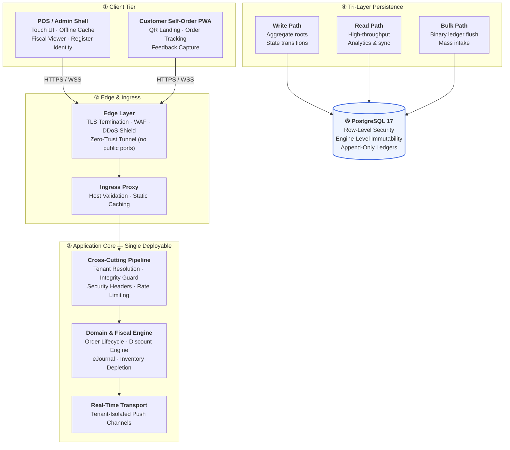

<div align="center">

# Enterprise Multi-Tenant POS & Fiscal Engine

**Philippine BIR-Compliant Retail Platform · Offline-First · Zero-Trust Hardened**

[](https://dotnet.microsoft.com/)
[](https://www.postgresql.org/)
[](https://react.dev/)
[](https://www.typescriptlang.org/)
[](https://docs.docker.com/compose/)

*An isolated-tenant retail engine built for regulated, high-concurrency,<br/>
network-unreliable environments — where statutory correctness is non-negotiable.*

</div>

---

> [!IMPORTANT]
> **Repository Notice — Public Architecture Overview**
>
> This repository is a **public architectural overview** describing the *shape* and *discipline* of the system: its topology, design decisions, and compliance posture.
>
> It is **not** a source distribution, an implementation reference, or a deployment guide. Proprietary business logic, endpoint contracts, cryptographic internals, tenant onboarding procedures, and commercial configuration are maintained in **private repositories** and are not published here.
>
> Nothing in this document grants any license — express or implied — to reproduce, reverse-engineer, or duplicate the system.

---

## 📑 Table of Contents

| § | Section |
| :-: | :--- |
| **1** | [Executive Summary](#1-executive-summary) |
| **2** | [Why This Project Matters](#2-why-this-project-matters) |
| **3** | [System Architecture](#3-system-architecture) |
| **4** | [Engineering Highlights](#4-engineering-highlights) |
| **5** | [Design Decisions](#5-design-decisions) |
| **6** | [Technology Stack](#6-technology-stack) |
| **7** | [Compliance Framework Alignment](#7-compliance-framework-alignment) |
| **8** | [Repository Structure](#8-repository-structure) |

---

## 1. Executive Summary

A single-deployable, multi-tenant Point-of-Sale and fiscal reporting platform engineered for **regulated retail environments** where statutory correctness, offline resilience, and tenant isolation are hard requirements — not features.

The system handles the full commercial lifecycle: catalog and recipe management, multi-tender ordering (touch POS + QR self-order), statutory discount computation, real-time inventory depletion, tamper-evident fiscal journaling, and BIR-compliant report generation.

**Built with:** .NET 10 (LTS) · PostgreSQL 17 · React 19 + TypeScript · Docker

**Engineering constraints that shaped every decision:**

- Sales must continue **when the network is down** — and reconcile without collision on recovery
- Fiscal records must be **provably un-tampered** — enforced at the database engine, not the application layer
- Tenants must be isolated at the **kernel level**, not merely filtered in queries
- Statutory computations must be **mathematically exact** to the centavo, per Philippine tax law
- The whole system must run on **commodity infrastructure** without sacrificing security posture

---

## 2. Why This Project Matters

This project demonstrates engineering judgment in a domain where **mistakes have legal and financial consequences**. Specifically, it shows competence in:

| Capability | Evidence in This System |
| :--- | :--- |
| **Regulated-domain design** | Models statutory discount rules, VAT stripping, and audit trails as first-class domain concepts — not afterthoughts |
| **Distributed systems reasoning** | Solves the "offline writes + eventual reconciliation" problem without collisions or data loss |
| **Defense-in-depth security** | Applies isolation at the database engine, the middleware layer, *and* the real-time transport layer |
| **Pragmatic polyglot persistence** | Uses three data access strategies — each chosen for the workload shape it serves, not for uniformity |
| **Compliance literacy** | Translates regulatory issuances into testable, code-level invariants |
| **Cost-conscious architecture** | Runs an enterprise-grade stack on commodity hardware behind a zero-trust tunnel |

> The compliance regime here is **Philippine BIR** — but the underlying patterns (immutable audit ledgers, statutory-rate engines, periodic fiscal rollups, tamper-evident chaining) map directly to VAT/GST regimes in the EU, UK, Australia, and GCC. The problem shape is universal; the jurisdiction is specific.

---

## 3. System Architecture

At a high level, the platform is organized into five layers. Each layer has a single, well-bounded responsibility.



**A note on the isolation model.** Tenant boundaries are enforced by the *database engine itself* — not by application code remembering to add a `WHERE tenant_id = ...` clause. Every transactional connection carries a session-scoped tenant context, and the engine's policy layer rejects any row that falls outside it. This is a deliberate choice: application-layer filtering is one forgotten predicate away from a cross-tenant data leak.

---

## 4. Engineering Highlights

### 4.1 Fiscal Compliance Engine

<details>
<summary><b>Offline-first statutory sales — with collision-free reconciliation</b></summary>

<br/>

Retail environments in emerging markets face routine network instability. The platform treats offline operation as a **first-class mode**, not a failure state:

- Sales continue against a locally-cached catalog and stock allocation
- Each offline invoice is stamped with a **terminal-scoped, gapless sequence** — guaranteeing no two registers can ever produce the same invoice number, even during a simultaneous multi-register outage
- On reconnection, a **batch reconciliation protocol** deduplicates by client-generated order identity, then applies the same statutory logic server-side

The reconciliation protocol is idempotent by design: replaying a batch produces the same result as submitting it once.

</details>

<details>
<summary><b>Tamper-evident fiscal journal</b></summary>

<br/>

Every fiscal event is written to an append-only journal protected by **two independent integrity layers**:

1. **Cryptographic chaining** — each entry is bound to its predecessor, forming a continuous verifiable chain. Any retrospective edit breaks the chain at a detectable point.
2. **Engine-level immutability** — the database engine itself rejects `UPDATE` and `DELETE` operations against historical journal rows. This is enforced by the RDBMS, not by the application, so it holds even against direct SQL access.

Verbatim thermal printer output is captured alongside the structured record — the exact byte stream issued to the customer is preserved for audit.

</details>

<details>
<summary><b>Statutory discount engine</b></summary>

<br/>

A line-item-level engine supporting multiple statutory beneficiary classes, each with its own legal basis and rate:

| Beneficiary Class | Statutory Basis | Rate |
| :--- | :--- | :-: |
| Senior Citizens | National senior-citizen welfare act | 20 % |
| Persons with Disability | National PWD welfare act | 20 % |
| National Athletes & Coaches | National athletes incentive act | 20 % |
| Solo Parents | Solo parent welfare act | 10 % |

Each discounted line is **removed from the VAT base entirely** before the discount is applied — a statutory requirement, not a pricing choice. Regular line items on the same ticket retain full VAT treatment. The engine also supports merchant-defined promotional discounts on individual lines, without disturbing statutory computations.

</details>

<details>
<summary><b>Regulatory report generation</b></summary>

<br/>

A vector PDF reporting engine produces every statutory book and slip required by the fiscal authority:

- **Sales Summary Book** — multi-column, multi-tier header, landscape format
- **Beneficiary Registers** — one per statutory class
- **Fiscal Slips** — both thermal-width and A4 variants
- **Operational Reports** — executive summary, category margins, ingredient depletion, tender breakdown, tax summaries, hourly trends, void analysis

Every report is generated from the same canonical data model — there is no parallel "reporting database" that can drift from the transactional one.

</details>

<details>
<summary><b>Continuous lifetime fiscal accumulator</b></summary>

<br/>

The fiscal accumulator functions as a **non-resettable cumulative odometer** that carries forward across shifts, terminals, and fiscal periods. It supports:

- Brownfield adoption (importing a historical base from a legacy system without breaking continuity)
- Deterministic Z-to-Z chaining
- Automatic rollover protection at the statutory maximum

Shift boundaries account for *all* payments tendered within the shift window, including late-settled orders — a subtle correctness detail that separates a compliant accumulator from a broken one.

</details>

---

### 4.2 Inventory & Concurrency

<details>
<summary><b>Three-mode inventory depletion model</b></summary>

<br/>

Retail operations span a wide spectrum — from a single-ingredient SKU to a multi-stage production recipe. The platform models all three shapes without forcing a single paradigm:

| Mode | Model | Typical Use |
| :-: | :--- | :--- |
| **1** | Standalone SKU | Direct-to-shelf retail goods |
| **2** | Hybrid recipe | Prepared items with a fallback SKU |
| **3** | Multi-tier bill-of-materials | Kitchen recipes with yields, waste factors, and nested components |

Depletion executes **synchronously at order settlement** — not in a background job — so stock figures are always consistent with settled orders.

</details>

<details>
<summary><b>Immutable stock movement ledger</b></summary>

<br/>

Every inventory change is recorded as an **immutable movement event** with a classification:

`SALE_DEDUCTION` · `PURCHASE_RECEIPT` · `WASTE_SPOILAGE` · `MANUAL_ADJUSTMENT`

Physical warehouse movements are kept cleanly separated from *theoretical* recipe costing — so the report a warehouse manager reads is never contaminated by the model an accountant reads.

</details>

<details>
<summary><b>Terminal concurrency &amp; device identity</b></summary>

<br/>

Terminals are identified by hardware fingerprint and validated through a continuous heartbeat protocol. Register prefixes are allocated dynamically from a tenant-scoped pool, and tier-based caps prevent a merchant from over-provisioning register identities beyond their licensed footprint.

Inactive terminals are automatically de-authorized, and operators can remotely revoke a lost or stolen device.

</details>

<details>
<summary><b>Omnichannel stock parity</b></summary>

<br/>

The same stock ledger enforces availability on **both** the cashier's touch screen and the customer's self-order QR page. When a strict-inventory tenant is active, zero-stock items cannot be added to a cart on either channel — and the server-side order invariant re-validates this regardless of what the client believed, closing the race window between two customers ordering the last unit.

</details>

---

### 4.3 Security Posture

> Design follows **NIST SP 800-53** control families, **OWASP Top 10** mitigation guidance, and **PCI-DSS 4.0** principles for payment-adjacent systems.

<details>
<summary><b>Zero-trust tenant isolation</b></summary>

<br/>

Authentication is not sufficient — every request's authenticated identity is cross-checked against the tenant partition it is attempting to touch. This eliminates the entire class of **BOLA / IDOR** vulnerabilities where a valid user of Tenant A tries to reach Tenant B's data by manipulating an identifier.

Real-time push channels enforce the same rule: a socket is admitted to a tenant's broadcast group only after its tenant claim is verified. Cross-tenant eavesdropping is structurally impossible, not merely disallowed.

</details>

<details>
<summary><b>Authentication hardening</b></summary>

<br/>

- **Constant-time credential verification** — the verification path executes identically whether the account exists or not, defeating username enumeration through timing side-channels
- **Sliding-window throttling** on authentication endpoints, with standard `Retry-After` semantics — protective against credential stuffing and brute force, while leaving real-time kitchen display traffic untouched
- **Perimeter route guards** — privileged administrative surfaces short-circuit to `401` before pipeline dispatch, so unauthorized probes never reach handler logic

</details>

<details>
<summary><b>Transport &amp; browser-level defenses</b></summary>

<br/>

- HSTS with preload semantics
- Strict Content Security Policy
- Anti-clickjacking via frame-ancestors restriction
- MIME-sniffing protection
- Restrictive `Permissions-Policy`
- **File-upload hardening** — binary magic-byte validation (not extension trust) plus active script sanitization on vector image formats

</details>

<details>
<summary><b>Database-engine isolation</b></summary>

<br/>

Row-Level Security is enforced by PostgreSQL itself. Application code cannot bypass it — even a compromised query path or a direct SQL session is bound by the same policy. Combined with the engine-level immutability trigger on the fiscal journal, this gives the platform **two independent integrity guarantees** that survive application-layer compromise.

</details>

---

## 5. Design Decisions

Formal **Architecture Decision Records (ADRs)** are maintained under `docs/adr/`. Each records the context, the considered alternatives, the decision, and the consequences.

| ADR | Decision |
| :--- | :--- |
| **ADR-001** | Statutory discount computation & single-portion rule for beneficiary classes |
| **ADR-002** | Fiscal reading shift boundaries & lifetime accumulator semantics |
| **ADR-003** | Three-tier inventory depletion modes & stock movement ledger model |
| **ADR-004** | Multi-tenant real-time channel isolation & middleware perimeter guarding |

These are the decisions that make the system **hard to modify casually** — which is the point. In a regulated domain, predictability beats cleverness.

---

## 6. Technology Stack

<table>
<tr>
<td valign="top" width="25%">

**Backend**
- .NET 10 (LTS)
- Minimal API host
- Real-time push (WebSocket)
- EF Core 10
- Dapper
- Npgsql / ADO.NET

</td>
<td valign="top" width="25%">

**Data**
- PostgreSQL 17
- Row-Level Security
- Engine-level immutability
- Materialized rollups
- Append-only ledgers

</td>
<td valign="top" width="25%">

**Frontend**
- React 19
- TypeScript
- Vite (PWA)
- Offline-capable client cache
- Touch-optimized POS shell

</td>
<td valign="top" width="25%">

**Infrastructure**
- Docker Compose
- Zero-trust ingress tunnel
- Edge WAF &amp; TLS termination
- Linux (commodity hardware)

</td>
</tr>
</table>

**A note on the tri-layer persistence choice.** Using three data-access strategies is not indecision — it is a deliberate acknowledgment that *writes*, *reads*, and *bulk loads* have materially different performance and correctness requirements. State transitions need aggregate-level integrity; menu synchronization needs sub-millisecond latency; ledger flushes need raw binary throughput. One ORM pretending to serve all three well serves none of them optimally.

---

## 7. Compliance Framework Alignment

**Philippine fiscal regime**

| Issuance | Subject | Coverage |
| :--- | :--- | :--- |
| **RR 10-2015** | POS machine specifications | Register identity, permit metadata, serial binding |
| **RR 10-2020** | Mandatory offline sales capability | Offline cache, terminal-prefixed sequencing, idempotent reconciliation |
| **RMO 10-2005** | Journal & audit trail | Cryptographic chaining, verbatim receipt capture, engine-level immutability |
| **RR 16-2018** | Receipt & invoice issuance | Sequenced SI numbering, thermal-format output |
| **RR 11-2018** | Beneficiary discounts | Statutory VAT-stripping engine |
| **TRAIN §237-A / RR 8-2022** | Electronic invoicing gateway | Standardized export payload for fiscal authority ingestion |
| **RMO 24-2023 Annexes** | Fiscal slips &amp; books | Z-read/X-read counters, drawer accountability audit, statutory books |

**Transferable design patterns.** The same primitives — immutable audit ledgers, statutory-rate engines, periodic fiscal rollups, tamper-evident chaining, tenant-isolated persistence — are directly applicable to:

- **EU / Ireland / Germany** — VAT directive compliance, GDPR-aligned tenant isolation, GoBD-compliant audit trails
- **Singapore** — IRAS InvoiceNow / GST regimes, PDPA data-handling principles
- **UAE / Dubai** — FTA e-invoicing readiness, VAT return generation
- **Australia / New Zealand** — ATO / IRD record-keeping and e-invoicing standards

The jurisdiction changes; the engineering discipline does not.

---

## 8. Repository Structure

This public repository contains documentation only:

```
.
├── README.md              ← this document
├── docs/
│   ├── architecture/      ← master blueprint, fiscal engine design, security model
│   └── adr/               ← architecture decision records
├── SECURITY.md            ← responsible disclosure policy
└── LICENSE                ← documentation license
```

Implementation source, tenant onboarding, deployment configuration, and commercial logic reside in **private repositories**.

---

<div align="center">

### Repository Notice

This document is a **public architectural overview** and design narrative.<br/>
It describes *what* the system does and *why* — not *how* it is implemented.<br/>
No license is granted to reproduce, reverse-engineer, or duplicate the system.

<sub>© Enterprise Multi-Tenant POS &amp; Fiscal Engine — Public Architecture Overview</sub>
